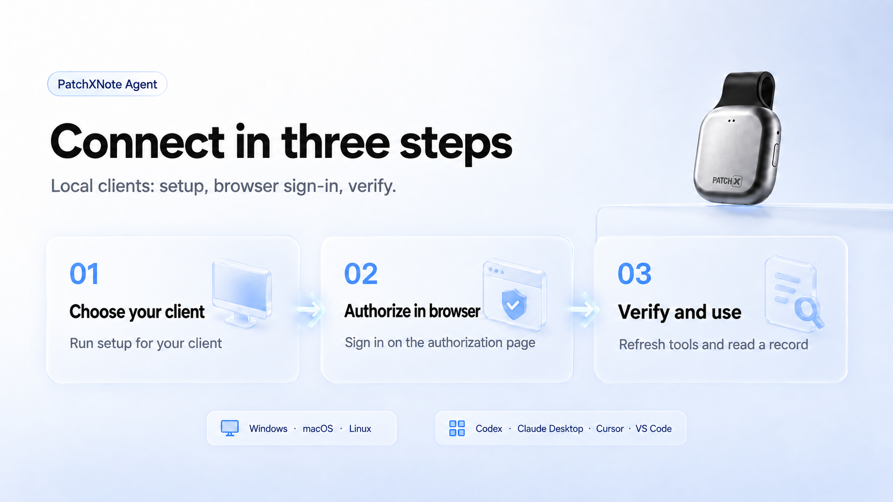

# PatchX Freenote Agent

PatchX Freenote was formerly called PatchXNote. Existing `patchxnote-agent` commands, `patchxnote-mcp` Skill installs, MCP configuration and credentials remain compatible.

[English](./README.md) | [简体中文](./README.zh-CN.md)

[](https://www.npmjs.com/package/patchxnote-agent)
[](https://github.com/ZsTs119/patchx-freenote-agent/releases)
[](https://registry.modelcontextprotocol.io/?q=patchxnote)
[](https://skills.sh/zsts119/patchx-freenote-agent/patchxnote-mcp)

Connect your synced PatchX Freenote records to AI assistants. Find records, review existing AI results, create Markdown drafts, and share approved content through webhooks.

[Production service](https://freenote.patch-x.cn/) · [MCP setup](https://freenote.patch-x.cn/mcp/setup/) · [Download App](https://freenote.patch-x.cn/download/) · [User guide (Chinese)](https://patchx2025.feishu.cn/wiki/PnVRwYT7IirFPckairGcWPnHnCd)


[Quickstart](#quickstart) · [Connection options](#choose-your-connection) · [Skill](#patchx-freenote-mcp-skill) · [Usage examples](#common-workflows) · [Troubleshooting](#troubleshooting) · [Reference](#mcp-tools)

## Published Channels

| Channel | Public entry | What is available |
| --- | --- | --- |
| npm | [patchxnote-agent](https://www.npmjs.com/package/patchxnote-agent) | Versioned CLI installer/launcher and bundled Skill; current release `0.2.15`. |
| GitHub Release | [v0.2.15](https://github.com/ZsTs119/patchx-freenote-agent/releases/tag/v0.2.15) | Six Windows/macOS/Linux binaries, checksums, and artifact attestations. |
| MCP official Registry | [Search the retained ID](https://registry.modelcontextprotocol.io/?q=patchxnote) · [Version record](https://registry.modelcontextprotocol.io/v0.1/servers/io.github.ZsTs119%2Fpatchxnote-agent/versions/0.2.15) | Registered as `io.github.ZsTs119/patchxnote-agent`. |
| Vercel skills.sh | [patchxnote-mcp](https://skills.sh/zsts119/patchx-freenote-agent/patchxnote-mcp) | New repository source, searchable as `PatchX Freenote`; Skill ID remains `patchxnote-mcp`. |

These links show publication and directory listing. The [0.2.15 verification record](./docs/evidence/2026-09-16-patchx-freenote-branding.zh-CN.md) documents artifact checks, Windows installation, local protocol discovery, and Registry readback; client/platform acceptance is tracked separately.

## Choose Your Connection

| Your environment | Use | Requirements |
| --- | --- | --- |
| Desktop editor or local MCP host | `npx -y patchxnote-agent@latest setup --client <client-id>` | Node.js 18+, Windows/macOS/Linux on amd64 or arm64, and a PatchX Freenote account. |
| Platform that supports Remote MCP and OAuth | `https://freenote.patch-x.cn/mcp` | Configure a custom connector and complete that platform's authorization flow; no local Node.js installation is required for this route. |
| Assistant that supports Agent Skills | Install [PatchX Freenote MCP Skill](#patchx-freenote-mcp-skill) | Adds setup and usage instructions; complements the MCP connection. |

Records must already be synced to PatchX Freenote and available to your account. Recorder-card connection, audio processing, and recording remain in the App/PC clients. Read records from the platform you select: `mobile` or `desktop`.

## Quickstart



### 1. Set up your local client

If your assistant supports Agent Skills, install the [Skill](#patchx-freenote-mcp-skill) first. MCP setup also works without it. Choose **one** command for the client you use:

| Client | Command |
| --- | --- |
| Cursor | `npx -y patchxnote-agent@latest setup --client cursor` |
| VS Code | `npx -y patchxnote-agent@latest setup --client vscode` |
| Codex | `npx -y patchxnote-agent@latest setup --client codex` |
| WorkBuddy desktop | `npx -y patchxnote-agent@latest setup --client workbuddy` |

Setup checks browser OAuth login and writes or prints the appropriate MCP config. Run it in the **same OS/runtime** that will launch MCP: Windows desktop apps and WSL/remote sessions use different credential stores. See [Client Setup](#client-setup) for other clients and manual configuration.

### 2. Authorize in the browser

Complete the PatchX Freenote sign-in page opened by setup. Keep phone verification codes and credentials on that page. If you need to start browser login explicitly:

```sh
npx -y patchxnote-agent@latest mcp login
```

### 3. Verify and use

```sh
npx -y patchxnote-agent@latest mcp status --verify --output json
```

Refresh or restart your MCP client, let it discover the available tools, then ask: **“Find up to five of today's mobile records.”** A successful empty result is normal when that account/platform has no matching records. See [Verify the Install](#verify-the-install) for additional checks.

### Using a hosted platform instead

Create a custom MCP connector named **PatchX Freenote MCP**, set its server URL to `https://freenote.patch-x.cn/mcp`, complete the platform's OAuth flow, and refresh its tool list. Follow the platform-specific instructions in [client integration notes](./docs/mcp-clients/README.zh-CN.md); support and acceptance vary by platform.

<details>
<summary>Copy the complete prompt for an AI assistant</summary>

```text
Help me connect PatchX Freenote MCP and install the PatchX Freenote MCP Skill when the client supports Agent Skills. Use the production service at https://freenote.patch-x.cn/ and the setup page at https://freenote.patch-x.cn/mcp/setup/; if existing configuration explicitly points to the old test service, update the server address used for this connection to production first. First, if this is a local command-capable environment, run npx -y patchxnote-agent@latest skill install on this machine so future or long sessions remember the PatchX Freenote SOP; if the current client does not support Skill installation, do not treat that as a connection blocker and continue with MCP setup according to the client's capabilities. Identify the MCP client you are running in: if this is a local MCP client such as Codex, Cursor, VS Code, Claude Desktop, Claude Code, or Windsurf, run npx -y patchxnote-agent@latest setup --client <client-id> on this machine in the same OS/runtime that will later launch the MCP server. If this is an AI client or cloud platform that cannot run local commands but supports Remote MCP, custom connectors, custom MCP services, or tool plugins, create a custom MCP connector named PatchX Freenote MCP and connect it with this PatchX Freenote Remote MCP URL: https://freenote.patch-x.cn/mcp. If you are not sure which client ID or config format to use, local clients should first run npx -y patchxnote-agent@latest mcp config and use the printed generic stdio config, while remote clients should look for a Remote MCP Server URL, MCP Server URL, or Custom Connector setup entry. For login, open the browser and let me complete PatchX Freenote phone-code authorization there; do not ask me to paste OTP codes, OAuth codes, authorization codes, access tokens, refresh tokens, or webhook secrets into chat. After setup, call patchxnote_get_current_user and patchxnote_list_memories with {"platform":"mobile","limit":5} to verify it works. References: https://github.com/ZsTs119/patchx-freenote-agent and https://patchx2025.feishu.cn/wiki/PnVRwYT7IirFPckairGcWPnHnCd
```

</details>

## Common Workflows

| Goal | Ask your assistant |
| --- | --- |
| Find synced records | “Find today's mobile records.” |
| Inspect an existing AI result | “Show the source text and saved AI result for this record.” |
| Prepare content to share | “Create a Markdown draft from this record. Let me review it before sending.” |
| Use a local webhook | “Send this approved Markdown to my Product Feishu webhook.” |

An existing record/result is the input. Local draft files and local webhook aliases require the local tools that provide those capabilities; check the connected endpoint's tool list before using them.

## PatchX Freenote MCP Skill

The Skill gives compatible assistants reusable setup, authorization, record lookup, result inspection, and approved webhook instructions. The npm package bundles it, so the recommended install does not require a separate GitHub clone:

```sh
npx -y patchxnote-agent@latest skill install
```

This installs the Skill into the user's `.agents/skills/patchxnote-mcp` directory by default. It does not log in to PatchX Freenote or start an MCP server.

<details>
<summary>Skill install options and existing-folder handling</summary>

Useful skill installer options:

| Option | Use |
| --- | --- |
| `--dry-run --json` | Preview target paths and conflict status without writing files. |
| `--home <path>` or `PATCHXNOTE_AGENT_SKILL_HOME=<path>` | Install into a test or alternate home directory. |
| `--agent universal\|codex\|cursor\|claude-code\|gemini-cli\|github-copilot\|all` | Target a known local skill directory family after its location is verified. |
| `--force` | Replace an existing unmanaged or manually edited `patchxnote-mcp` skill after explicit user intent. |

The installer is idempotent. If an existing `patchxnote-mcp` directory differs and is not managed by this package, it refuses to overwrite it unless `--force` is supplied. Managed installs include `.patchxnote-agent-skill.json` with the package version and source hash.

</details>

<details>
<summary>Alternative: install with the skills CLI</summary>

For users of the standard skills CLI, this Codex example installs from GitHub into the current project. It installs the Skill, not the MCP connection. Choose either this route or the npm-bundled install above.

```sh
npx -y skills add ZsTs119/patchx-freenote-agent --skill patchxnote-mcp --agent codex --yes
```

</details>

## Login And MCP Modes

The client transport and the source of its tools are separate:

- `mcp serve` speaks **stdio** to the local client. In default `auto` mode, matching, unexpired browser OAuth credentials select a proxy to the hosted MCP service; otherwise it uses the local implementation.
- The local implementation provides **19 tool definitions** in `0.2.15`. Their data calls still require appropriate authentication. A proxied or directly connected hosted service supplies its own tool set and may differ.
- Use the connected endpoint's `tools/list` result as the source of truth for available tools. Local filesystem and webhook capabilities listed below describe the local implementation.
- `mcp login` is the browser OAuth entry. Terminal-only `patchxnote login` remains the separate legacy Agent login. `mcp serve` does not open a login browser when the editor starts.

## Client Setup

<details>
<summary>Supported clients and advanced setup flags</summary>

Local setup supports these client IDs:

```text
vscode, cursor, codex, claude-code, claude-desktop, windsurf, trae, qoder, workbuddy
```

`vscode`, `cursor`, `codex`, `claude-desktop`, and `windsurf` can write a local config file after confirmation. `claude-code`, `trae`, `qoder`, and `workbuddy` return manual commands or copyable config in V1. Platform clients such as Feishu Aily, Doubao Work Partner, Tencent Agent Development Platform, and enterprise WorkBuddy require the hosted remote MCP gateway and platform-console acceptance instead of local `npx`.

Useful setup flags:

```sh
patchxnote setup --client cursor --dry-run --print-config
patchxnote setup --client cursor --yes
patchxnote setup --client cursor --no-browser
patchxnote setup --all-local-supported --dry-run
patchxnote setup --client cursor --output json
```

Run setup in the same OS/runtime that will later launch MCP. For example, a Windows desktop editor needs Windows Credential Manager credentials, while a WSL or remote VS Code session needs credentials in that Linux runtime.

</details>

## MCP Configuration

<details>
<summary>Manual stdio configuration and absolute-path fallback</summary>

For generic local stdio MCP hosts, use the pure JSON printed by:

```sh
npx -y patchxnote-agent@latest mcp config
```

The default config looks like this:

```json
{
  "mcpServers": {
    "patchxnote": {
      "command": "npx",
      "args": ["-y", "patchxnote-agent@latest", "mcp", "serve"]
    }
  }
}
```

Some clients may require a wrapper-specific field such as `type: "stdio"` or a different top-level key, but the `command` and `args` stay the same. If a client rejects `npx`, kills slow cold starts, or requires allowlisted absolute paths, use the fallback printed by:

```sh
npx -y patchxnote-agent@latest install --print-config
```

The fallback config uses the installed binary path:

```json
{
  "mcpServers": {
    "patchxnote": {
      "command": "/absolute/path/to/patchxnote",
      "args": ["mcp", "serve"]
    }
  }
}
```

</details>

## MCP Tools

<details>
<summary>Local implementation: 19 tool definitions</summary>

### Account And Record Lookup

| Tool | Purpose |
| --- | --- |
| `patchxnote_get_current_user` | Show the current PatchX Freenote account status. |
| `patchxnote_list_recorder_cards` | List bound recorder cards with masked identifiers only. |
| `patchxnote_get_quota_summary` | Show current quota. |
| `patchxnote_get_model_usage_summary` | Show current-month AI usage and charged quota. |
| `patchxnote_list_memories` | List records for `mobile` or `desktop`. |
| `patchxnote_search_memories` | Search record basics cached in the current MCP session. |
| `patchxnote_get_memory` | Show safe basic information for one record. |

### Webhook Configuration And Sending

| Tool | Purpose |
| --- | --- |
| `patchxnote_list_webhook_targets` | List local webhook aliases and masked metadata. |
| `patchxnote_configure_webhook_target` | Create or update a webhook alias; URL and secret inputs are write-only. |
| `patchxnote_remove_webhook_target` | Remove a webhook alias and best-effort clean up stored secrets. |
| `patchxnote_list_webhook_templates` | List built-in Markdown templates. |
| `patchxnote_render_webhook_message` | Render a record into Markdown and optionally save a local draft. |
| `patchxnote_export_model_io` | Export a complete AI processing record to a user-chosen local file. |
| `patchxnote_send_webhook` | Manually send Markdown, a draft, a rendered record, or a test message to target aliases. |

### AI Result Inspection

| Tool | Purpose |
| --- | --- |
| `patchxnote_list_model_io_traces` | Find AI processing runs and the follow-up `request_id`. |
| `patchxnote_get_model_io_source_text` | Inspect or export the source text used for that run. |
| `patchxnote_get_model_io_provider_response` | Inspect or export the AI response. |
| `patchxnote_get_model_io_parsed_result` | Inspect or export the parsed AI result. |
| `patchxnote_get_model_io_packaged_result` | Inspect or export the final result. |

Record tools require an explicit `platform` argument: `mobile` or `desktop`. The record list now includes formal saved results plus readable model-generated outputs when the server has model IO data. `patchxnote model-io list` remains the lower-level AI processing list for finding request IDs and filtering by task or state.

Webhook MCP tools share the same local config, keychain, templates, and sender modules as the CLI. They do not return full webhook URLs or signing secrets, and send calls perform external network requests only when the MCP client explicitly invokes the send tool.

AI result tools are explicit inspection tools. They may expose source text or AI payloads for the logged-in user, so use them only from trusted local MCP hosts. Large fields should be written to an explicit local `out` file.

</details>

## CLI Commands

<details>
<summary>CLI command reference</summary>

The examples below are independent commands. Choose the operation for your task; they are not one script to run from top to bottom.

Browser MCP login and local MCP service:

```sh
patchxnote version
patchxnote mcp login
patchxnote mcp status
patchxnote mcp config
patchxnote setup --client cursor
patchxnote mcp serve
```

Terminal CLI login:

```sh
patchxnote login
patchxnote auth status
```

List AI processing runs and export results:

```sh
patchxnote model-io list --platform mobile
patchxnote model-io source-text --request-id <request_id> --platform mobile --out ./source.txt
patchxnote model-io provider-response --request-id <request_id> --platform mobile --out ./provider-response.json
patchxnote model-io parsed-result --request-id <request_id> --platform mobile --out ./parsed-result.json
patchxnote model-io packaged-result --request-id <request_id> --platform mobile --out ./packaged-result.json
patchxnote model-io export --request-id <request_id> --platform mobile --out ./model-io.json
```

Get `request_id` from `patchxnote model-io list --platform mobile|desktop` when you need a lower-level AI processing run. MCP `patchxnote_list_memories` returns `id` and `platform` for record rendering, drafts, webhook workflows, and model IO field tools; for model-generated entries, that `id` can be the same value as `request_id`.

Configure and send webhooks:

```sh
patchxnote webhook set "Product Feishu" --type feishu --url-stdin
patchxnote webhook list
patchxnote webhook test "Product Feishu"
patchxnote webhook draft --memory-id <memory_id> --platform mobile --out ./patchxnote-drafts/example
patchxnote webhook send --target "Product Feishu" --file ./message.md
patchxnote webhook send --target "Product Feishu" --draft ./patchxnote-drafts/example
patchxnote webhook remove "Product Feishu"
```

Useful global flags:

```sh
--server-base-url <url>   PatchX Freenote API base URL
--profile <name>          local profile name
--output json             machine-readable output where supported
--config <path>           non-secret config file path
```

The npm package is a small installer/launcher wrapper:

```sh
npx -y patchxnote-agent@latest mcp login
npx -y patchxnote-agent@latest mcp status
npx -y patchxnote-agent@latest mcp config
npx -y patchxnote-agent@latest mcp serve
npx -y patchxnote-agent@latest skill install
npx -y patchxnote-agent@latest login
npx -y patchxnote-agent@latest setup --client cursor
npx -y patchxnote-agent@latest install
npx -y patchxnote-agent@latest update
```

Webhook URLs and optional Feishu/DingTalk signing secrets are stored in the local secure credential store, not in the non-secret config file. `--url-stdin` and `--secret-stdin` avoid shell history. CLI and MCP webhook sending is manual only, does not follow redirects, and surfaces provider errors directly.

`patchxnote model-io export` is the preferred complete AI processing export command. `patchxnote webhook export-model-io` remains available for compatibility.

</details>

## Verify The Install

These checks do not sign you out or overwrite client configuration:

```sh
npm view patchxnote-agent@latest version --registry https://registry.npmjs.org
npx -y --registry https://registry.npmjs.org patchxnote-agent@latest skill install --dry-run --json
npx -y --registry https://registry.npmjs.org patchxnote-agent@latest mcp config
npx -y --registry https://registry.npmjs.org patchxnote-agent@latest mcp status --output json
```

After authorization, add `--verify` to `mcp status` to verify access. If the native binary is on PATH, `patchxnote version` reports its version and release commit. The current published release is `0.2.15`.

## Troubleshooting

| Problem | What to check |
| --- | --- |
| `patchxnote` is not found after install | Add the printed install directory to PATH, then open a new terminal. |
| Login says credential storage is unavailable | Check that macOS Keychain, Windows Credential Manager, or Linux Secret Service is available and unlocked. For local development only, set `PATCHXNOTE_AUTH_INSECURE_FILE_KEYCHAIN=true`. |
| MCP login expired or points at the wrong server | Run `npx -y patchxnote-agent@latest mcp logout --local-only`, then run `npx -y patchxnote-agent@latest mcp login` again in the same runtime. |
| MCP host cannot start the server | If first start is slow or the client rejects `npx`, run `npx -y patchxnote-agent@latest install --print-config` once and use the printed absolute `command` path. |
| Setup writes credentials in the wrong place | Run setup from the same OS/runtime that will launch MCP. Windows desktop apps, WSL terminals, and VS Code Remote do not automatically share keychain credentials. |
| Need to undo setup | Restore the timestamped `.bak-YYYYMMDDTHHMMSSZ` file printed by setup, or remove only the `patchxnote` MCP server entry from the client config. |
| Record list is empty | Check that you selected the correct `platform`: `mobile` or `desktop`; use `model-io list` for lower-level AI processing runs. |
| Webhook did not send | Confirm the alias exists, the target is enabled, and check the provider error returned by the command. |
| Checksum verification fails | Retry later or pin a known version; the installer refuses unchecked binaries. |
| `skill install` says the target already exists and differs | The target contains an unmanaged or manually edited `patchxnote-mcp` skill. Inspect or back it up first; rerun with `--force` only when you want PatchX Freenote Agent to replace that skill folder. |
| Wrong server environment | Use `--server-base-url <url>` when logging in to another environment, and use a separate profile. |
| New release returns `ETARGET` | Check `npm config get registry`. A mirror may not have synced yet; use the one-command official-registry example below. |

```sh
npx -y --registry https://registry.npmjs.org patchxnote-agent@latest install --print-config
```

This applies the registry choice to this command only. If a GitHub download is slow, retry later; the npm-bundled Skill avoids a separate repository clone.

<details>
<summary>Existing test-environment configuration</summary>

Version `0.2.12` and later default to production. Existing explicit `--server-base-url` flags, `PATCHXNOTE_SERVER_BASE_URL` / legacy `PATCHNOTE_SERVER_BASE_URL` environment variables, and `server.base_url` config values override that default; update or remove test-server overrides in both the terminal and MCP host configuration.

Run `mcp login` in the same OS/runtime and profile that starts MCP, then check `mcp status --verify`. OAuth credentials are bound to the server address, so test login does not authenticate production. This update does not migrate test accounts or records. To keep both environments, use separate profiles and an explicit base URL for each.

</details>

## Sign Out And Undo Setup

Choose the action you need; these are separate maintenance operations:

| Action | Command or instructions |
| --- | --- |
| Sign out of MCP | `npx -y patchxnote-agent@latest mcp logout` |
| Remove only local MCP credentials | `npx -y patchxnote-agent@latest mcp logout --local-only` |
| Undo client setup | Restore the timestamped backup printed by setup, or remove its `patchxnote` entry from that client's configuration. |
| Uninstall the managed native binary | `npx -y patchxnote-agent@latest uninstall` |

## Security And Risk Notice

- PatchX Freenote server data access is read-only. Agent does not bind hardware, read raw audio, trigger model runs, handle payments, or expose Admin APIs.
- Local webhook configuration and user-approved sending are supported local actions. Sending is explicit, with no automatic background delivery.
- Credentials use OS-native secure storage; MCP config contains no bearer tokens or webhook secrets. Windows, WSL, and remote runtimes do not automatically share credentials.
- Records are scoped to the authenticated account and selected `mobile` or `desktop` platform. Source text, AI results, exported files, and webhook destinations may be sensitive.
- Review content before sharing and use trusted MCP clients. Report vulnerabilities through [SECURITY.md](./SECURITY.md), without posting credentials or private records in public issues.

## Current Limitations

Search covers record basics cached during the current local MCP session. Linux headless environments need an available secure credential store. Hosted-platform acceptance and local installation are separate; see the [client status notes](./docs/mcp-clients/README.zh-CN.md). This is a public beta, without a production SLA.

## Release History

[GitHub Releases](https://github.com/ZsTs119/patchx-freenote-agent/releases)

<details>
<summary>Release highlights from 0.2.6 to 0.2.15</summary>

### 0.2.15 Highlights

- Corrects the MCP Registry namespace to preserve GitHub owner casing: `io.github.ZsTs119/patchxnote-agent`.
- Adds the `mcp serve` launch arguments and validates release metadata before publication.
- Keeps the existing runtime behavior and Skill license.

### 0.2.13 Highlights

- Unifies the English and Chinese setup prompts across README, npm, the bundled Skill, and marketplace copy.
- Explicitly names the production service, Remote MCP endpoint, setup page, and App download URL; existing test-address overrides must be updated when switching.
- Points npm and plugin homepage metadata to the production setup page and retires obsolete domain proposals in current guidance.

### 0.2.12 Highlights

- Defaults to the production API at `https://freenote.patch-x.cn`; hosted MCP uses `https://freenote.patch-x.cn/mcp`.
- Keeps explicit server flags, environment variables, and config-file overrides available for test environments.
- Documents production re-login and migration of existing test-server configurations.

### 0.2.11 Highlights

- Bundles the canonical PatchX Freenote MCP Skill inside the npm package.
- Adds `npx -y patchxnote-agent@latest skill install` for npm-based skill installation without relying on a separate skills CLI or GitHub clone.
- Makes skill installation idempotent, records a managed marker, and protects manually edited skill folders unless `--force` is explicitly used.
- Extends skill package sync and validation so OpenAI, Claude, and npm copies stay byte-identical to `skills/patchxnote-mcp/`.
- Updates the one-line setup prompt and discovery metadata to prefer the npm-bundled skill installer while preserving MCP setup, browser OAuth, and tool verification.

### 0.2.10 Highlights

- Adds the reusable PatchX Freenote MCP Skill at `skills/patchxnote-mcp/` so compatible AI clients can keep the setup and usage SOP across fresh or long sessions.
- Adds OpenAI/Codex, Claude Code, Agent Skills, MCP Registry, Smithery, and third-party directory draft packaging and listing materials.
- Adds MCP Registry metadata through `server.json` and `package.json#mcpName`, plus local validation and stdio smoke scripts for release evidence.
- Updates the one-line setup prompt so agents install the skill when supported, then run MCP setup, browser OAuth, and tool verification without asking users to paste codes or tokens into chat.

### 0.2.9 Highlights

- Polishes the browser OAuth loopback success and failure pages shown after `patchxnote mcp login`.
- Keeps the post-login result page focused on plain user guidance, without exposing OAuth codes, state values, or token-shaped details.
- Adds regression coverage for the browser callback pages so future changes keep those sensitive details out of the UI.

### 0.2.8 Highlights

- Adds `patchxnote setup --client <id>` and npm wrapper delegation with dry-run, JSON output, confirmation, config printing, force repair, and local MCP smoke hooks.
- Adds a client registry for VS Code, Cursor, Codex, Claude Code, Claude Desktop, Windsurf, Trae, Qoder, WorkBuddy, Feishu/Doubao, Tencent platform, and P1 follow-up clients.
- Adds JSON and TOML config merge adapters with backup, conflict detection, rollback, and manual JSONC mode.
- Adds `patchxnote mcp login/status/logout`, browser OAuth with PKCE, MCP OAuth secure storage, and remote `/mcp` stdio proxy mode with local fallback.
- Adds website page specs, detail-page copy, and remote platform gateway design for product-style onboarding.

### 0.2.6 Highlights

- MCP expands to 19 tools across account/record lookup, webhook delivery, and AI result inspection.
- Webhook workflows are available to MCP: configure named aliases and manually send to Feishu, DingTalk, or generic webhooks.
- AI processing runs can be listed first, then inspected by `request_id` for source text, AI response, parsed result, and final result.
- Record lists can now include readable model-generated outputs returned by the server, so users can find a record first and then inspect its source text, AI response, parsed result, or final result.
- Webhook aliases containing dots, Chinese text, or spaces now persist and reload correctly from the local config file.
- README, npm README, and public visual assets have been refreshed for the new user-facing positioning.

</details>

## Development

For architecture, local development, and checks appropriate to your change, read [AGENTS.md](./AGENTS.md), [engineering rules](./docs/engineering-rules.md), and the [release and maintenance runbook](./docs/release-and-maintenance-runbook.zh-CN.md). Metadata-only releases use the affected-module validation described in that runbook.

## Release Notes For Operators

The [runbook](./docs/release-and-maintenance-runbook.zh-CN.md) covers version synchronization, GitHub Release assets, npm Trusted Publishing, and release verification. Current evidence: [0.2.15](./docs/evidence/2026-09-16-patchx-freenote-branding.zh-CN.md).

## License

This repository is currently published without an open-source license. Contact PatchX Freenote before redistributing or embedding it in another product.
