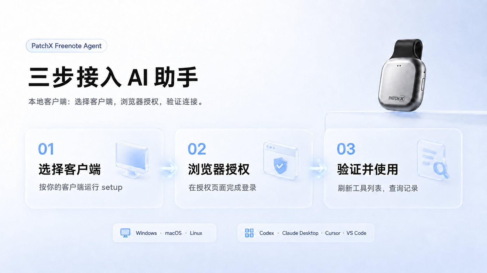

# PatchX Freenote Agent

PatchX Freenote 原名 PatchXNote。现有 `patchxnote-agent` 命令、`patchxnote-mcp` Skill、MCP 配置及本机凭据继续兼容。

[English](./README.md) | [简体中文](./README.zh-CN.md)

[](https://www.npmjs.com/package/patchxnote-agent)
[](https://github.com/ZsTs119/patchx-freenote-agent/releases)
[](https://registry.modelcontextprotocol.io/?q=patchxnote)
[](https://skills.sh/ZsTs119/patchxnote-agent/patchxnote-mcp)

把已同步的 PatchX Freenote 记录接入 AI 助手：查找记录、查看已有 AI 结果、生成 Markdown 草稿，并在确认后通过 webhook 分享。

[生产服务](https://freenote.patch-x.cn/) · [MCP 接入页面](https://freenote.patch-x.cn/mcp/setup/) · [下载 App](https://freenote.patch-x.cn/download/) · [使用指南](https://patchx2025.feishu.cn/wiki/PnVRwYT7IirFPckairGcWPnHnCd)


[快速开始](#快速开始) · [选择接入方式](#选择接入方式) · [Skill](#patchx-freenote-mcp-skill) · [使用场景](#常用场景) · [问题排查](#常见问题排查) · [工具参考](#mcp-工具)

## 公开发布与生态收录

| 渠道 | 公开入口 | 当前可获取的内容 |
| --- | --- | --- |
| npm | [patchxnote-agent](https://www.npmjs.com/package/patchxnote-agent) | CLI 安装／启动壳及随包 Skill；当前发行版本 `0.2.15`。 |
| GitHub Release | [v0.2.15](https://github.com/ZsTs119/patchx-freenote-agent/releases/tag/v0.2.15) | Windows/macOS/Linux 六平台二进制、校验清单及制品来源证明。 |
| MCP 官方 Registry | [搜索 PatchX Freenote](https://registry.modelcontextprotocol.io/?q=patchxnote) · [版本记录](https://registry.modelcontextprotocol.io/v0.1/servers/io.github.ZsTs119%2Fpatchxnote-agent/versions/0.2.15) | 登记名为 `io.github.ZsTs119/patchxnote-agent`。 |
| Vercel skills.sh | [patchxnote-mcp](https://skills.sh/ZsTs119/patchxnote-agent/patchxnote-mcp) | 可检索的 Skill 详情及安装说明。 |

这些链接用于核对公开发行和目录收录。[0.2.15 验证记录](./docs/evidence/2026-09-16-patchx-freenote-branding.zh-CN.md)包含制品校验、Windows 安装、本地协议发现和 Registry 回读；各客户端／平台的接入验收单独记录。

## 选择接入方式

| 你的环境 | 使用入口 | 前提 |
| --- | --- | --- |
| 桌面编辑器或本地 MCP 客户端 | `npx -y patchxnote-agent@latest setup --client <client-id>` | Node.js 18+，Windows/macOS/Linux 的 amd64 或 arm64 环境，以及 PatchX Freenote 账号。 |
| 支持 Remote MCP 和 OAuth 的平台 | `https://freenote.patch-x.cn/mcp` | 配置自定义连接器并完成平台授权流程；此方式不要求在本机安装 Node.js。 |
| 支持 Agent Skills 的 AI 助手 | 安装 [PatchX Freenote MCP Skill](#patchx-freenote-mcp-skill) | 提供接入和使用说明，配合 MCP 连接使用。 |

记录应已同步到 PatchX Freenote，并对当前账号可读。录音卡连接、音频处理和录音仍由 App/PC 完成。查询时选择对应来源：`mobile` 或 `desktop`。

## 快速开始



### 1. 配置本地客户端

如果 AI 助手支持 Agent Skills，建议先安装 [Skill](#patchx-freenote-mcp-skill)；不支持时也可以继续 MCP 接入。按实际使用的客户端选择**一条**命令：

| 客户端 | 命令 |
| --- | --- |
| Cursor | `npx -y patchxnote-agent@latest setup --client cursor` |
| VS Code | `npx -y patchxnote-agent@latest setup --client vscode` |
| Codex | `npx -y patchxnote-agent@latest setup --client codex` |
| WorkBuddy 桌面端 | `npx -y patchxnote-agent@latest setup --client workbuddy` |

setup 会检查浏览器 OAuth 登录，并写入或打印对应的 MCP 配置。请在**真正启动 MCP 的同一个 OS／运行时**执行：Windows 桌面应用与 WSL／远程环境使用不同的凭据存储。其他客户端和手动配置见[客户端 setup](#客户端-setup)。

### 2. 在浏览器完成授权

在 setup 打开的 PatchX Freenote 页面完成登录，手机号验证码和凭据留在授权页面处理。如果需要单独发起浏览器登录：

```sh
npx -y patchxnote-agent@latest mcp login
```

### 3. 验证并使用

```sh
npx -y patchxnote-agent@latest mcp status --verify --output json
```

刷新或重启 MCP 客户端，让它发现可用工具，然后尝试：**“帮我查找今天手机端的记录，最多五条。”** 当前账号／平台没有匹配记录时，查询成功但返回空列表也是正常结果。其他检查见[验证安装](#验证安装)。

### 使用托管平台时

创建名为 **PatchX Freenote MCP** 的自定义 MCP 连接器，将服务地址设为 `https://freenote.patch-x.cn/mcp`，完成该平台的 OAuth 流程并刷新工具列表。具体步骤参考[客户端接入说明](./docs/mcp-clients/README.zh-CN.md)，各平台的支持方式和验收状态有所区别。

<details>
<summary>复制完整接入提示给 AI 助手</summary>

```text
请帮我接入 PatchX Freenote MCP，并在客户端支持 Agent Skills 时安装 PatchX Freenote MCP Skill。请使用生产服务地址 https://freenote.patch-x.cn/，接入页面为 https://freenote.patch-x.cn/mcp/setup/；如现有配置显式指定了旧测试地址，请先将本次接入使用的服务地址调整为上述生产地址。首先，如果当前是支持本地命令执行的环境，请在本机执行 npx -y patchxnote-agent@latest skill install，让后续新会话或长上下文能记住 PatchX Freenote SOP；如果当前客户端不支持 Skill 安装，不要判定为不能接入，请继续按客户端能力完成 MCP 接入。请识别你所在的 MCP 客户端：如果是 Codex、Cursor、VS Code、Claude Desktop、Claude Code、Windsurf 等本地 MCP 客户端，请在当前本机、并且在后续会启动 MCP 服务的同一个运行时执行 npx -y patchxnote-agent@latest setup --client <client-id>；如果是不支持本机命令但支持 Remote MCP、自定义连接器、自定义 MCP 服务或工具插件的 AI 客户端/云平台，请创建名为 PatchX Freenote MCP 的自定义 MCP 连接器，并使用这个 PatchX Freenote Remote MCP URL 完成接入：https://freenote.patch-x.cn/mcp。如果不确定客户端 ID 或配置格式，本地客户端先执行 npx -y patchxnote-agent@latest mcp config 并使用打印出的通用 stdio 配置，远程客户端则优先寻找 Remote MCP Server URL / MCP Server URL / Custom Connector 配置入口。登录时请打开浏览器让我完成 PatchX Freenote 手机号验证码授权，不要让我把验证码、OAuth code、授权码、access token、refresh token 或 webhook secret 粘贴到聊天里。完成后请调用 patchxnote_get_current_user 和 patchxnote_list_memories，参数 {"platform":"mobile","limit":5} 验证可用。参考资料：https://github.com/ZsTs119/patchx-freenote-agent 和 https://patchx2025.feishu.cn/wiki/PnVRwYT7IirFPckairGcWPnHnCd。
```

</details>

## 常用场景

| 目标 | 可以这样对 AI 说 |
| --- | --- |
| 查找已同步记录 | “帮我找今天手机端的记录。” |
| 查看已有 AI 结果 | “查看这条记录的原文文本和已保存的 AI 整理结果。” |
| 准备分享内容 | “将这条记录生成 Markdown 草稿，我确认后再发送。” |
| 使用本机 webhook | “把这份已确认的 Markdown 发到‘产品群 飞书’。” |

这些操作以已有记录／结果为输入。本地草稿文件和本机 webhook 别名需要对应的本地工具能力，使用前以当前连接端点返回的工具列表为准。

## PatchX Freenote MCP Skill

Skill 为兼容的 AI 助手提供可重复使用的接入、授权、记录查询、结果查看和已确认 webhook 操作指引。npm 包已内置 Skill，推荐安装方式不需要单独克隆 GitHub 仓库：

```sh
npx -y patchxnote-agent@latest skill install
```

默认安装到用户目录中的 `.agents/skills/patchxnote-mcp`。Skill 本身不会登录 PatchX Freenote，也不会启动 MCP 服务。

<details>
<summary>Skill 安装参数及已有目录处理</summary>

常用 skill installer 参数：

| 参数 | 用途 |
| --- | --- |
| `--dry-run --json` | 只预览目标路径和冲突状态，不写文件。 |
| `--home <path>` 或 `PATCHXNOTE_AGENT_SKILL_HOME=<path>` | 安装到测试 home 或自定义 home。 |
| `--agent universal\|codex\|cursor\|claude-code\|gemini-cli\|github-copilot\|all` | 在确认目标客户端 skills 目录后，写入指定客户端目录族。 |
| `--force` | 在用户明确同意后，替换已有的非托管或手动修改过的 `patchxnote-mcp` skill。 |

安装器支持重复执行。如果已有 `patchxnote-mcp` 目录内容不同，并且不是本 npm 包托管的目录，它会拒绝覆盖，除非显式传入 `--force`。托管安装会写入 `.patchxnote-agent-skill.json`，记录 npm 包版本和 source hash。

</details>

<details>
<summary>其他入口：使用 skills CLI 安装</summary>

使用标准 skills CLI 时，以下 Codex 示例从 GitHub 安装到当前项目。它只安装 Skill，不会完成 MCP 连接；与上方 npm 随包安装方式按需选择一种。

```sh
npx -y skills add ZsTs119/patchx-freenote-agent --skill patchxnote-mcp --agent codex --yes
```

</details>

## 登录和 MCP 形态

客户端使用的传输方式，与工具实际运行的位置，需要分别理解：

- `mcp serve` 通过 **stdio** 与本地客户端通信。默认 `auto` 模式下，存在匹配且有效的浏览器 OAuth 凭据时，会代理到托管 MCP 服务；否则使用本地实现。
- `0.2.15` 的本地实现提供 **19 个工具定义**，其中的数据调用仍需对应登录授权。通过代理或直接连接的托管服务提供自己的工具集，数量和能力可能不同。
- 可用工具以实际连接端点的 `tools/list` 为准。下方涉及本地文件和 webhook 的工具表描述的是本地实现。
- `mcp login` 是浏览器 OAuth 入口；终端方式的 `patchxnote login` 保留为独立的旧 Agent 登录。编辑器启动 `mcp serve` 时不会自动打开登录浏览器。

## 客户端 setup

<details>
<summary>支持的客户端与进阶 setup 参数</summary>

本地 setup 支持以下客户端 ID：

```text
vscode, cursor, codex, claude-code, claude-desktop, windsurf, trae, qoder, workbuddy
```

`vscode`、`cursor`、`codex`、`claude-desktop`、`windsurf` 会在确认后写入本地配置文件。`claude-code`、`trae`、`qoder`、`workbuddy` 在 V1 返回手动命令或可复制配置。飞书 Aily、豆包工作伙伴、腾讯 Agent 平台、企业版 WorkBuddy 这类平台客户端需要走服务端远程 MCP 网关，并在平台控制台完成真实验收，不能只靠本机 `npx`。

常用 setup 参数：

```sh
patchxnote setup --client cursor --dry-run --print-config
patchxnote setup --client cursor --yes
patchxnote setup --client cursor --no-browser
patchxnote setup --all-local-supported --dry-run
patchxnote setup --client cursor --output json
```

请在未来真正启动 MCP 的同一个 OS/运行时执行 setup。比如 Windows 桌面编辑器使用 Windows Credential Manager，WSL 或 VS Code Remote 则需要在对应 Linux 运行时登录。

</details>

## MCP 配置

<details>
<summary>手动 stdio 配置与绝对路径 fallback</summary>

通用本地 stdio MCP Host 可以直接使用下面命令打印的纯 JSON：

```sh
npx -y patchxnote-agent@latest mcp config
```

默认配置如下：

```json
{
  "mcpServers": {
    "patchxnote": {
      "command": "npx",
      "args": ["-y", "patchxnote-agent@latest", "mcp", "serve"]
    }
  }
}
```

有些客户端可能要求额外写 `type: "stdio"`，或者使用不同的顶层字段名，但 `command` 和 `args` 不变。如果客户端拒绝 `npx`、首次冷启动太慢或只允许白名单绝对路径，可以改用下面命令打印的 fallback：

```sh
npx -y patchxnote-agent@latest install --print-config
```

fallback 配置会使用已安装二进制的绝对路径：

```json
{
  "mcpServers": {
    "patchxnote": {
      "command": "/absolute/path/to/patchxnote",
      "args": ["mcp", "serve"]
    }
  }
}
```

</details>

## MCP 工具

<details>
<summary>本地实现：19 个工具定义</summary>

### 账号和记录查询

| 工具 | 用途 |
| --- | --- |
| `patchxnote_get_current_user` | 查看当前 PatchX Freenote 账号状态。 |
| `patchxnote_list_recorder_cards` | 查看已绑定录音卡，只返回脱敏标识。 |
| `patchxnote_get_quota_summary` | 查看当前账号额度。 |
| `patchxnote_get_model_usage_summary` | 查看当月 AI 使用情况和扣费额度。 |
| `patchxnote_list_memories` | 按 `mobile` 或 `desktop` 查看可读记录入口。 |
| `patchxnote_search_memories` | 搜索当前会话已缓存的记录基础信息。 |
| `patchxnote_get_memory` | 查看单条记录的安全基础信息。 |

### Webhook 配置和发送

| 工具 | 用途 |
| --- | --- |
| `patchxnote_list_webhook_targets` | 查看本机配置过的 webhook 别名和脱敏信息。 |
| `patchxnote_configure_webhook_target` | 新增或更新 webhook 别名；URL 和密钥是只写输入。 |
| `patchxnote_remove_webhook_target` | 删除 webhook 别名并尽力清理本机密钥。 |
| `patchxnote_list_webhook_templates` | 查看内置 Markdown 模板。 |
| `patchxnote_render_webhook_message` | 把记录渲染成 Markdown，可选保存成本地草稿。 |
| `patchxnote_export_model_io` | 把完整 AI 整理记录导出到用户指定的本地文件。 |
| `patchxnote_send_webhook` | 手动发送 Markdown、草稿、记录渲染结果或测试消息到指定别名。 |

### AI 整理结果查看

| 工具 | 用途 |
| --- | --- |
| `patchxnote_list_model_io_traces` | 查找 AI 整理记录，拿到后续查看用的处理编号 `request_id`。 |
| `patchxnote_get_model_io_source_text` | 查看或导出当时使用的原文文本。 |
| `patchxnote_get_model_io_provider_response` | 查看或导出 AI 返回内容。 |
| `patchxnote_get_model_io_parsed_result` | 查看或导出 AI 解析后的结果。 |
| `patchxnote_get_model_io_packaged_result` | 查看或导出最终整理结果。 |

记录类工具必须显式传入 `platform`：`mobile` 或 `desktop`。记录列表现在会包含正式保存结果，也会包含服务端已有 model IO 的模型整理输出。`patchxnote model-io list` 仍然是更底层的 AI 调用列表，适合按任务类型、状态或 request_id 排查。

webhook MCP 工具复用 CLI 的本地配置、钥匙串、模板和发送模块。工具不会返回完整 webhook URL 或签名密钥；只有 MCP client 明确调用发送工具时才会发起外部网络请求。

AI 整理结果工具是显式查看能力。它可能返回当前登录用户的原文文本或 AI 结果，因此只建议在可信本地 MCP Host 中使用。大字段建议写入显式 `out` 本地文件。

</details>

## CLI 命令

<details>
<summary>展开 CLI 命令参考</summary>

以下为独立命令示例，请按任务选择操作，不要当作一个脚本从头到尾执行。

浏览器 MCP 登录和本地 MCP 服务：

```sh
patchxnote version
patchxnote mcp login
patchxnote mcp status
patchxnote mcp config
patchxnote setup --client cursor
patchxnote mcp serve
```

CLI 终端登录：

```sh
patchxnote login
patchxnote auth status
```

查看 AI 整理记录和导出结果：

```sh
patchxnote model-io list --platform mobile
patchxnote model-io source-text --request-id <request_id> --platform mobile --out ./source.txt
patchxnote model-io provider-response --request-id <request_id> --platform mobile --out ./provider-response.json
patchxnote model-io parsed-result --request-id <request_id> --platform mobile --out ./parsed-result.json
patchxnote model-io packaged-result --request-id <request_id> --platform mobile --out ./packaged-result.json
patchxnote model-io export --request-id <request_id> --platform mobile --out ./model-io.json
```

需要底层 AI 调用记录时，`request_id` 来自 `patchxnote model-io list --platform mobile|desktop`。MCP `patchxnote_list_memories` 会返回 `id` 和 `platform`，可用于记录渲染、草稿、webhook 和 model IO 字段工具；如果这条入口来自模型整理输出，这个 `id` 也可以就是 `request_id`。

配置和发送 webhook：

```sh
patchxnote webhook set "产品群 飞书" --type feishu --url-stdin
patchxnote webhook list
patchxnote webhook test "产品群 飞书"
patchxnote webhook draft --memory-id <memory_id> --platform mobile --out ./patchxnote-drafts/example
patchxnote webhook send --target "产品群 飞书" --file ./message.md
patchxnote webhook send --target "产品群 飞书" --draft ./patchxnote-drafts/example
patchxnote webhook remove "产品群 飞书"
```

常用全局参数：

```sh
--server-base-url <url>   PatchX Freenote API base URL
--profile <name>          本地 profile 名称
--output json             支持时输出机器可读 JSON
--config <path>           非 secret 配置文件路径
```

npm 包本身是轻量安装/启动壳：

```sh
npx -y patchxnote-agent@latest mcp login
npx -y patchxnote-agent@latest mcp status
npx -y patchxnote-agent@latest mcp config
npx -y patchxnote-agent@latest mcp serve
npx -y patchxnote-agent@latest skill install
npx -y patchxnote-agent@latest login
npx -y patchxnote-agent@latest setup --client cursor
npx -y patchxnote-agent@latest install
npx -y patchxnote-agent@latest update
```

webhook URL 和飞书/钉钉可选签名密钥只写入本机安全钥匙串，不写普通配置文件。建议用 `--url-stdin` 和 `--secret-stdin` 避免 shell history。CLI 和 MCP 的 webhook 发送都只支持用户手动执行，不跟随重定向，下游平台错误会直接透传给用户。

`patchxnote model-io export` 是完整 AI 整理记录导出的推荐命令。`patchxnote webhook export-model-io` 会继续兼容保留。

</details>

## 验证安装

以下检查不会退出登录，也不会覆盖客户端配置：

```sh
npm view patchxnote-agent@latest version --registry https://registry.npmjs.org
npx -y --registry https://registry.npmjs.org patchxnote-agent@latest skill install --dry-run --json
npx -y --registry https://registry.npmjs.org patchxnote-agent@latest mcp config
npx -y --registry https://registry.npmjs.org patchxnote-agent@latest mcp status --output json
```

完成授权后，可以给 `mcp status` 加上 `--verify` 核对访问状态。原生二进制已加入 PATH 时，`patchxnote version` 可查看版本和发行提交。当前已发布版本为 `0.2.15`。

## 常见问题排查

| 问题 | 检查项 |
| --- | --- |
| 安装后找不到 `patchxnote` | 把安装器打印的目录加入 PATH，然后打开新终端。 |
| 登录提示凭据存储不可用 | 检查 macOS Keychain、Windows Credential Manager 或 Linux Secret Service 是否可用且已解锁。本地开发才使用 `PATCHXNOTE_AUTH_INSECURE_FILE_KEYCHAIN=true`。 |
| MCP 登录过期或连到了错误服务端 | 先运行 `npx -y patchxnote-agent@latest mcp logout --local-only`，再在同一个运行时执行 `npx -y patchxnote-agent@latest mcp login`。 |
| MCP Host 启动失败 | 如果首次启动较慢或客户端拒绝 `npx`，先运行 `npx -y patchxnote-agent@latest install --print-config`，再使用它打印出的绝对 `command` 路径。 |
| setup 把登录态写到了错误环境 | 在真正启动 MCP server 的同一个 OS/运行时执行 setup。Windows 桌面应用、WSL 终端、VS Code Remote 默认不共享钥匙串。 |
| 需要撤销 setup 修改 | 恢复 setup 打印的时间戳 `.bak-YYYYMMDDTHHMMSSZ` 备份文件，或只删除客户端配置里的 `patchxnote` MCP server 项。 |
| 记录列表为空 | 检查是否选择了正确的 `platform`：`mobile` 或 `desktop`；底层 AI 调用记录请用 `model-io list`。 |
| webhook 没发出去 | 确认别名存在、目标启用，并检查下游平台返回的错误信息。 |
| checksum 校验失败 | 稍后重试或固定已知版本；安装器会拒绝未校验二进制。 |
| `skill install` 提示目标已存在且内容不同 | 目标目录里已有非托管或手动修改过的 `patchxnote-mcp` skill。先检查或备份；只有确认要让 PatchX Freenote Agent 替换该 skill 目录时，再执行 `--force`。 |
| 连到了错误服务端 | 登录其他环境时使用 `--server-base-url <url>`，并为不同环境使用独立 profile。 |
| 新版安装返回 `ETARGET` | 先用 `npm config get registry` 查看来源；镜像可能尚未同步，可对本次命令指定下方官方源。 |

```sh
npx -y --registry https://registry.npmjs.org patchxnote-agent@latest install --print-config
```

此写法只对本次命令指定官方源，不修改默认 registry。GitHub 下载较慢时可稍后重试；npm 随包 Skill 安装可避免单独克隆仓库。

<details>
<summary>已有测试环境配置如何处理</summary>

`0.2.12` 及后续版本默认连接生产环境。已有的 `--server-base-url` 参数、`PATCHXNOTE_SERVER_BASE_URL` / 兼容变量 `PATCHNOTE_SERVER_BASE_URL`、配置文件中的 `server.base_url` 会覆盖默认值；请同时检查终端和 MCP 客户端配置，修改或移除测试地址覆盖项。

在启动 MCP 的同一个运行时和 profile 下执行 `mcp login`，再执行 `mcp status --verify`。OAuth 凭据与服务地址绑定，测试环境登录态不能直接用于生产；此次升级不会迁移测试账号或记录。如需同时使用两套环境，请使用不同 profile 并分别指定服务地址。

</details>

## 退出登录和撤销配置

按需要选择相应操作，以下各项独立使用：

| 操作 | 命令或说明 |
| --- | --- |
| 退出 MCP 登录 | `npx -y patchxnote-agent@latest mcp logout` |
| 只清除本地 MCP 凭据 | `npx -y patchxnote-agent@latest mcp logout --local-only` |
| 撤销客户端 setup | 恢复 setup 打印的时间戳备份，或移除该客户端配置中的 `patchxnote` 项。 |
| 卸载托管的原生二进制 | `npx -y patchxnote-agent@latest uninstall` |

## 安全与风险提示

- PatchX Freenote 服务端数据访问保持只读；Agent 不绑定硬件、不读取原始音频、不触发模型运行，也不处理支付或 Admin API。
- 本地 webhook 配置和用户已确认的发送属于支持的本地操作。发送须明确触发，不会在后台自动发生。
- 凭据保存在系统原生安全存储中，MCP 配置不包含 bearer token 或 webhook 密钥。Windows、WSL 和远程环境不会自动共享凭据。
- 记录按登录账号及 `mobile`／`desktop` 平台限定范围。原文文本、AI 结果、导出文件和 webhook 目标可能包含私密信息。
- 分享前确认内容，使用可信 MCP 客户端。安全问题按 [SECURITY.md](./SECURITY.md) 的流程报告，不要在公开 Issue 中发布凭据或私密记录。

## 当前限制

搜索覆盖当前本地 MCP 会话已缓存的记录基础信息。Linux headless 环境需要可用的安全凭据存储。托管平台接入验收与本地安装单独记录，见[客户端状态说明](./docs/mcp-clients/README.zh-CN.md)。当前为公测版本，不提供生产 SLA。

## 版本记录

[GitHub Releases](https://github.com/ZsTs119/patchx-freenote-agent/releases)

<details>
<summary>0.2.6 至 0.2.15 更新重点</summary>

### 0.2.15 更新重点

- 修正 MCP Registry 登记名大小写：`io.github.ZsTs119/patchxnote-agent`，与 GitHub 发布身份一致。
- 补齐 `mcp serve` 启动参数，在发版前校验关联元数据。
- 沿用现有运行行为和 Skill 许可。

### 0.2.13 更新重点

- 统一 README、npm、随包 Skill 和 marketplace 的中英文一句话接入文案。
- 明确生产服务、Remote MCP、接入页面和 App 下载地址，并提示切换时调整显式测试地址配置。
- npm 和插件主页指向生产接入页面，当前指引不再使用旧域名设想。

### 0.2.12 更新重点

- 默认连接生产 API `https://freenote.patch-x.cn`；远程 MCP 入口为 `https://freenote.patch-x.cn/mcp`。
- 保留命令行、环境变量和配置文件覆盖地址的能力，方便继续使用测试环境。
- 补充已有测试环境配置的迁移和生产重新登录说明。

### 0.2.11 更新重点

- 将 canonical PatchX Freenote MCP Skill 打包进 npm package。
- 新增 `npx -y patchxnote-agent@latest skill install`，可以通过 npm 安装 skill，不再依赖单独的 skills CLI 或 GitHub clone。
- skill 安装支持重复执行，会写入托管标记；已有手动修改目录时默认保护性拒绝，只有显式 `--force` 才会替换。
- 扩展 skill 包同步和校验，让 OpenAI、Claude、npm 三份副本和 `skills/patchxnote-mcp/` 保持字节一致。
- 更新一句话 setup prompt 和搜索元数据：优先使用 npm-bundled skill installer，同时保留 MCP setup、浏览器 OAuth 和工具验证流程。

### 0.2.10 更新重点

- 新增可复用的 PatchX Freenote MCP Skill：`skills/patchxnote-mcp/`，让兼容 AI 客户端在新会话或长上下文里继续记住 setup 和使用 SOP。
- 新增 OpenAI/Codex、Claude Code、Agent Skills、MCP Registry、Smithery 和第三方目录的首版草稿包与 listing 文案。
- 新增 MCP Registry 元数据：`server.json` 和 `package.json#mcpName`，并补充本地校验与 stdio smoke 脚本作为发布证据。
- 更新一句话 setup prompt：客户端支持时先安装 skill，再执行 MCP setup、浏览器 OAuth 和工具验证，且不要求用户把验证码或 token 粘贴到聊天里。

### 0.2.9 更新重点

- 优化 `patchxnote mcp login` 完成后的浏览器成功页和失败页。
- 登录结果页只保留用户能理解的普通提示，不展示 OAuth code、state 或 token 形态信息。
- 增加 callback 页面回归测试，避免后续改动把敏感或技术信息重新展示到页面上。

### 0.2.8 更新重点

- 新增 `patchxnote setup --client <id>` 和 npm wrapper 转发，支持 dry-run、JSON 输出、确认写入、配置打印、force 修复和本地 MCP 冒烟钩子。
- 新增客户端 registry，覆盖 VS Code、Cursor、Codex、Claude Code、Claude Desktop、Windsurf、Trae、Qoder、WorkBuddy、飞书/豆包、腾讯平台和 P1 后续客户端。
- 新增 JSON/TOML 配置合并适配器，带备份、冲突检测、回滚和 JSONC 手动模式。
- 新增 `patchxnote mcp login/status/logout`、带 PKCE 的浏览器 OAuth、MCP OAuth 安全存储，以及远程 `/mcp` stdio 代理模式和本地 fallback。
- 新增官网页面规格、客户端详情页文案和远程平台 MCP 网关设计。

### 0.2.6 更新重点

- MCP 工具扩展到 19 个，覆盖账号和记录查询、webhook 配置发送、AI 整理结果查看。
- webhook 支持 MCP 调用：可以配置中文别名，手动发送到飞书、钉钉或其他 webhook。
- 新增 AI 整理记录列表，AI 可以先找到 `request_id`，再查看原文文本、AI 返回内容、解析结果和最终整理结果。
- 记录列表现在可以包含服务端返回的模型整理输出，用户可以先找到记录入口，再查看原文文本、AI 返回内容、解析结果或最终整理结果。
- webhook 别名里包含点号、中文和空格时，现在可以正确保存并重新读取。
- README、npm README 和公开图片素材已按新能力更新。

</details>

## 开发

架构、本地开发及各类改动对应的检查，请参阅 [AGENTS.md](./AGENTS.md)、[工程规则](./docs/engineering-rules.md)和[发布维护手册](./docs/release-and-maintenance-runbook.zh-CN.md)。纯发行元数据变更按手册中的实际受影响模块选择验证。

## 发布维护说明

[维护手册](./docs/release-and-maintenance-runbook.zh-CN.md)包含版本同步、GitHub Release 制品、npm Trusted Publishing 和发布验证流程。当前证据：[0.2.15](./docs/evidence/2026-09-16-patchx-freenote-branding.zh-CN.md)。

## 许可证

当前仓库尚未发布开源许可证。重新分发或嵌入其他产品前，请先联系 PatchX Freenote。
